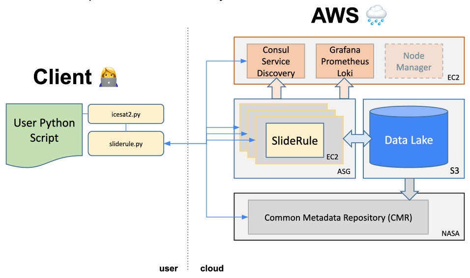

# Summary 
SlideRule is an open-source server-side framework for on-demand processing of science data in the cloud. SlideRule provides researchers and other data systems with low-latency access to custom-generated, high-level, analysis-ready data products using processing parameters supplied at the time of the request. The Sliderule project offers a new paradigm for NASA missions - rapid delivery of customized science data products directly to users, rather than storing/hosting standard derivative products or requiring user download and low-level processing prior to analysis.

While SlideRule can be accessed by any http client (e.g., curl) through GET and POST requests, the sliderule-python client provides user-friendly API and functionality for easy interaction with the SlideRule service, with community-standard Python data type returns (i.e., Pandas DataFrame, GeoDataFrame).

The ICESat-2 SlideRule plug-in for the sliderule-python client supports science applications for the NASA Ice Cloud and land Elevation Satellite-2 (ICESat-2) mission. The ICESat-2 plug-in includes a simplified, cloud-optimized version of the ATL06 fitting algorithm to process the lower-level ATL03 photon data products hosted in native HDF5 format on AWS by the NSIDC DAAC [@atl03_nsidc]. The user specifies an area of interest, key algorithm parameters (e.g., segment length), and desired subsets of photon classes from multiple supported classification strategies (ATL03, ATL08 and YAPC). Custom data products containing thousands to millions of derived points are returned in seconds to minutes, enabling rapid parameter iteration, and subsequent scientific analysis, visualization, and output of archive-ready files for reproducible science. 

The SlideRule project includes detailed documentation with several example Jupyter notebooks and scripts, and an interactive web-based demo app for ICESat-2 processing and visualization. We are continuing to improve support for large requests (e.g., processing all granules over Antarctica or all RGI glacier polygons). In the coming years, SlideRule will support processing altimetry data from other missions (e.g., GEDI), raster data, and efficient server-side fusion of the two data types.

# Statement of need
The Ice, Cloud, and Land Elevation Satellite – 2 (ICESat-2) launched in September 2018 to continue as the follow on mission to the original ICESat mission (2003-2010) which pioneered the use of a space-based laser altimeter to measure the height of the Earth. As the names imply, these missions are optimized to measure elevation changes in the cryosphere, including ice sheets and sea ice. The ICESat-2 mission [@markus2017ice] leveraged the lessons and achievements of ICESat and provides a substantial improvement in spatial and temporal coverage.

ICESat-2 carries the Advanced Topographic Laser Altimeter System (ATLAS), which generates six laser footprints on the Earth’s surface, and records the time the laser light leaves ATLAS, and the time reflected photons of laser light return to ATLAS [@neumann2019ice]. Combining the time of flight with the pointing vectors for the beams with the position of the observatory in space allows the ground processing to establish a precise latitude, longitude, and height for each photon. These data allow scientists to study the height of our planet, and by aggregating these data in space and time, study the changes in the height of Earth.

The ICESat-2 Level 2A Geolocated Photon Data Product (ATL03) [@neumann2019atbd] provides unique latitude, longitude, height and timing of ICESat-2 photons, and is the lowest level data product most scientists will use. ATL03 provides an initial photon classification, identifying them as likely signal photons reflected off Earth, or as likely background photons due to sunlight or instrument noise. The product, however, also contains a wide range of additional parameters that may not be of use to most users, and the product format is somewhat complex. The complexity and large data volume (~2 GB per granule) of the ATL03 products present a barrier to development and verification of new algorithms, and for data exploration by new users.

The ICESat-2 project generates a range of higher-level products [@nsidc_url] that reduce the ATL03 data using established processing algorithms. These products provide the user with a more accurate determination of the height of Earth, posted at lower along-track resolution than the ATL03 product. In particular, the ATL06 product [@smith2019ice] provides high-precision estimates of surface height at 40-meter resolution, using parameters appropriate to flat, highly reflective polar snow surfaces. Similar to ATL03, the ATL06 products contain a large number of parameters describing each height measurement that may not be useful to all users. The ATL06 products are distributed as ~100 MB granules that are often too large for convenient data exploration, and are generally only produced over glaciers and ice sheets. Further, the 40-meter resolution of ATL06 may be too coarse for some applications, and the algorithm used to segregate photons returned from the surface may not be optimal for complex land surfaces or for vegetated surfaces. SlideRule provides users with the ability to generate products using the vetted ATL06 algorithm, but with parameters and photon classification strategies tailored to the characteristics of their application and study sites.

## State of the Field

#### Granule download
The current paradigm for using data from the ICESat-2 mission involves downloading large volumes of standard data products from a NASA Distributed Active Archive Center (DAAC). The National Snow and Ice Data Center (NSIDC) offers subsetting services allowing users to download geographic subsets of products, and to select the specific variables to be included in the subsets. These services are sufficient for many science applications, but not all, and users may experience substantial latency that reduces these services' utility for data exploration and analysis. 

#### On-demand Data Processing
Several other projects are exploring on-demand, cloud-based processing for satellite and/or point cloud data. 
The Alaska Satellite Facility's Hybrid Pluggable Processing Pipeline (ASF HyP3) [@hogenson_kirk_2020_6917373] enables custom processing of satellite SAR images from multiple missions. 
The [OpenTopography project](https://opentopography.org/) offers "Web service-based data access, processing, and analysis capabilities that are scalable, extensible, and innovative" with emphasis on "high-resolution (meter to sub-meter scale), Earth science-oriented, topography data acquired with lidar and other technologies." The current processing options and data products are focused on airborne LiDAR point clouds, with no plans to support ICESat-2 data.

#### ICESat-2 packages
`icepyx` [@scheick2019ipx] is a python library for querying the NASA Common Metadata Repository (CMR) and allowing for programmatic access to ICESat-2 data through NSIDC services. `icepyx` allows for queries based on spatial and temporal parameters, as well as ICESat-2 orbital cycle and Reference Ground Track (RGT). Accessing NSIDC API services through icepyx allows users to spatiotemporally subset ICESat-2 data and convert data to other file formats. At present, `icepyx` allows users to read and visualize data available from NSIDC, but it is not a data processing service.

The `OpenAltimetry` platform [@khalsa2020openaltimetry], which is related to the OpenTopography project, offers discovery, access, and visualization of data from NASA’s ICESat and ICESat-2 missions. This service includes an API that can provide access to either photon-level data or height variables from the along-track products, but does not offer processing from photons to higher-level products.

`phoREAL` ([Photon Research and Engineering Analysis Library](https://github.com/icesat-2UT/PhoREAL)) from the University of Texas is an open-source application allowing for subsetting and conversion of ICESat-2 ATL03 Global Geolocated Photon Height and ATL08 Land and Vegetation Height data products. `phoREAL` allows users to spatially subset locally available data and subset based on Ground Track. `phoREAL` allows users to visualize data from both ATL03 and ATL08 and perform some statistics on heights based on time or geospatial location. 

`captoolkit` (Cryosphere Altimetry Processing Toolkit) [@fernando_paolo_2020_3665785] is a software library from the NASA Jet Propulsion Library (JPL). `captoolkit` allows users to estimate elevation change using altimetry data from multiple airborne and satellite missions.`captoolkit` has functions to apply geophysical corrections, calculate elevation change, and interpolate into gridded fields. `captoolkit` is built for processing on High Performance Computing (HPC) clusters by subsetting datasets into smaller granules and using parallelized functions. 

# SlideRule Framework
SlideRule is a C++/Lua framework for on-demand data processing \autoref{fig:architecture}. It is a science data processing service that runs in the cloud and responds to REST API calls to process and return science results.

# Algorithm Description
The ICESat-2-slideRule API provides two main types of services. The first provides access to existing ICESat-2 products stored as cloud assets, the second provides a customized level-2 product (ATL06-SR) generated on demand from the ATL03 cloud assets.

### ATL03 photon-data access
SlideRule provides services that allow users to access ATL03 photon-height and classification data from cloud assets without the need to download entire granules, returning the subset of ATL03 parameters that are needed to interpret surface heights from the photon-height distribution.

For vegetated surfaces, a more advanced photon classification scheme has been made available as part of the ATL08 Land and Vegetation Height product [@neuenschwander2019atl08]. This classification approach allows improved segregation between photons returned from vegetation, photons that reflected from land surfaces, and noise. Users wishing to apply this classification to ATL03 data would ordinarily need to download both an ATL03 granule and the corresponding ATL08 granule, and apply the classification from ATL08 to ATL03. The ICESat-2 slideRule API includes an option to retrieve the photon classifications from ATL08 cloud assests, and apply them directly to ATL03 photons for subsequent processing.

## ATL06-SR
The ATL06 (land-ice height) product provided by NASA's ICESat-2 [@smith2019land] (hereafter ATL06-legacy) provides estimates of surface height derived from ATL03 photon height using an algorithm adapted to the flat surfaces and high reflectivities common over polar ice sheets. Briefly, the algorithm uses photons identified as likely surface returns by the ATL03 photon classification, or by a backup algorithm where the ATL03 classification fails, to estimate the height and slope of 40-meter-long line segments for data from each of ICESat-2's ground tracks. It uses an iterative algorithm to improve the initial photon classification, and calculates a set of corrections based on the residuals between the segment heights and the selected photon heights to correct for sub-centimeter biases in the resulting height estimates.

ATL06-SR implements much of the ATL06-legacy algorithm in a framework that allows customization of the initial photon classification, the resolution and posting of the product, and the filtering strategy used to identify valid segments. For the sake of simplicity and speed of calculation, ATL06-SR omits some of the corrections required for sub-centimeter accuracy over polar surfaces, including the first-photon bias and pulse-shape corrections [@smith2019land]. Over non-polar surfaces, omitting these biases should result in sub-centimeter vertical errors in ATL06-SR heights.

One important difference between the ATL06-legacy and ATL06-SR algorithms is in the iterative photon-selection strategy. Both algorithms begin with photons selected based on the input photon classification. The selection is then refined to reject photons that have large residual values (i.e., larger than three times a robust estimate of the standard deviation of the previously selected residuals) and the fit is recalculated. This process continues until a specified number of iterations has occurred, or until subsequent iterations leave the photon selection unchanged. In ATL06-legacy, at each iteration the photons are selected from the complete set of input photons, regardless of how they were initially flagged or selected, while in ATL06-SR, each iteration selects photons exclusively from those selected in the previous iteration. This means that in ATL06-legacy, the number of photons can increase from one iteration to the next, while in ATL06-SR it can only remain constant or decrease. This choice lets ATL06-SR more faithfully reflect the height distribution of the initial selection, at the expense of sometimes missing photons close to the surface that might add more information to the fitting algorithm, possibly improving the accuracy of the fit. Under most circumstances, the two algorithms produce very similar results.
 
### Photon classification 
The ATL06-SR algorithm supports three sources of photon classification data: 
  * ATL03 photon confidence values, based on algorithm-specific classification types for land, ocean, sea-ice, land-ice, or inland water [@neumann2019ice]
  * ATL08 photon classification [@neuenschwander2019atl08]
  * YAPC (Yet Another Photon Classification) photon-density-based classification [@tyler_sutterley_2022_6717591]

Users can select the classification values to be included in the initial photon selection for the ATL06-SR fitting. For example, a user might wish to generate ATL06-SR products based only on photons with ATL03 photon classification values indicating medium or better confidence, or might request a product based only on photons flagged in ATL08 as coming from 'ground' to remove photons from canopy returns. The rapid processing offered by the SlideRule service allows for interactive testing and evaluation of various combinations of ATL06-SR parameter and classificaiton schemes for user-specific applications.

# Acknowledgements

The SlideRule project is funded by the NASA ICESat-2 project and NASA award 80NSSC20K0995.

# References
